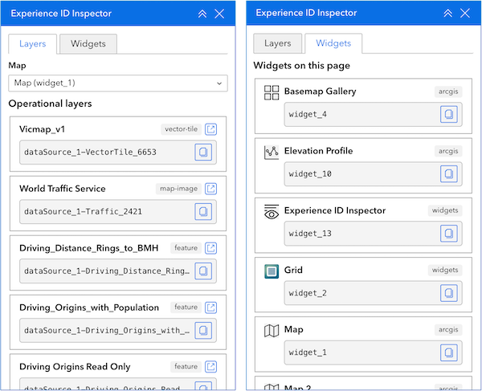

# Experience Builder ID Inspector

**Authoring tool for ArcGIS Experience Builder** to quickly inspect **data source IDs** and **widget instance IDs** during app design.

---

## What it does

`exb-inspector` is an **admin-only utility widget** for ArcGIS Experience Builder that helps authors and support teams identify internal IDs used in configuration and custom development.

It runs **only in Experience Builder (Design mode)** and is not intended for end users of published apps.

### Screenshot



---

## Key features

- **Layers tab**  
  Select a map on the current page and view all **operational layers** with their Experience Builder **data source IDs** (copy to clipboard)

- **Widgets tab**  
  View all **widget instance IDs** on the current page (`widget_3`, etc.), including body, header/footer, sections, and controllers (copy to clipboard)

- **Designer-only tool**  
  Only active in Experience Builder Design mode. Displays a short notice in deployed apps

- **Zero configuration**  
  No settings required. Everything reflects the live app state

---

## Installation

### Option 1 — ArcGIS Enterprise (recommended)

This is the simplest installation method.

#### Step 1 — Copy the manifest URL

`https://cartinuum.github.io/exb-inspector/latest/exb-inspector/manifest.json`

#### Step 2 — Register the widget

1. Sign in to **ArcGIS Enterprise** as an administrator  
1. Go to **Content → New Item → Experience Builder widget**  
1. Paste the manifest URL  
1. Save  

#### Step 3 — Use in Experience Builder

- Open Experience Builder  
- Edit an app  
- Add **exb-inspector** from the widget panel  
- Use it during design time to inspect IDs  

---

### Option 2 — Experience Builder Developer Edition

Use this if you are working locally with Developer Edition.

#### Step 1 — Download this repository

```bash
git clone https://github.com/cartinuum/exb-inspector.git
```

#### Step 2 — Copy the widget

Copy the `widgets/exb-inspector` folder into your Experience Builder installation at: 

```
<your-exb-root>/client/your-extensions/widgets/exb-inspector
```

#### Step 3 — Start Experience Builder

```bash
cd client
npm start
```

The widget will now be available in the builder.

---

## Usage

1.	Open your app in Experience Builder (Design mode)
1.	Add the exb-inspector widget to the page

Use:
* **Layers tab** → find data source IDs for layers
* **Widgets tab** → find widget instance IDs

Click to copy values directly to your clipboard.

---

## Compatibility

* ArcGIS Enterprise: 11.3+
* Built with Experience Builder Developer Edition 1.14

---

## Important notes

* This widget is intended for authors and developers only
* It is not designed for end users
* If included in published apps, the widget displays a simple notice instead of the inspector UI

---

## Versioning

* latest → always points to the most recent version
* versioned releases (e.g. 1.0.0) are available for stable environments

Example:

`https://cartinuum.github.io/exb-inspector/1.0.0/exb-inspector/manifest.json`